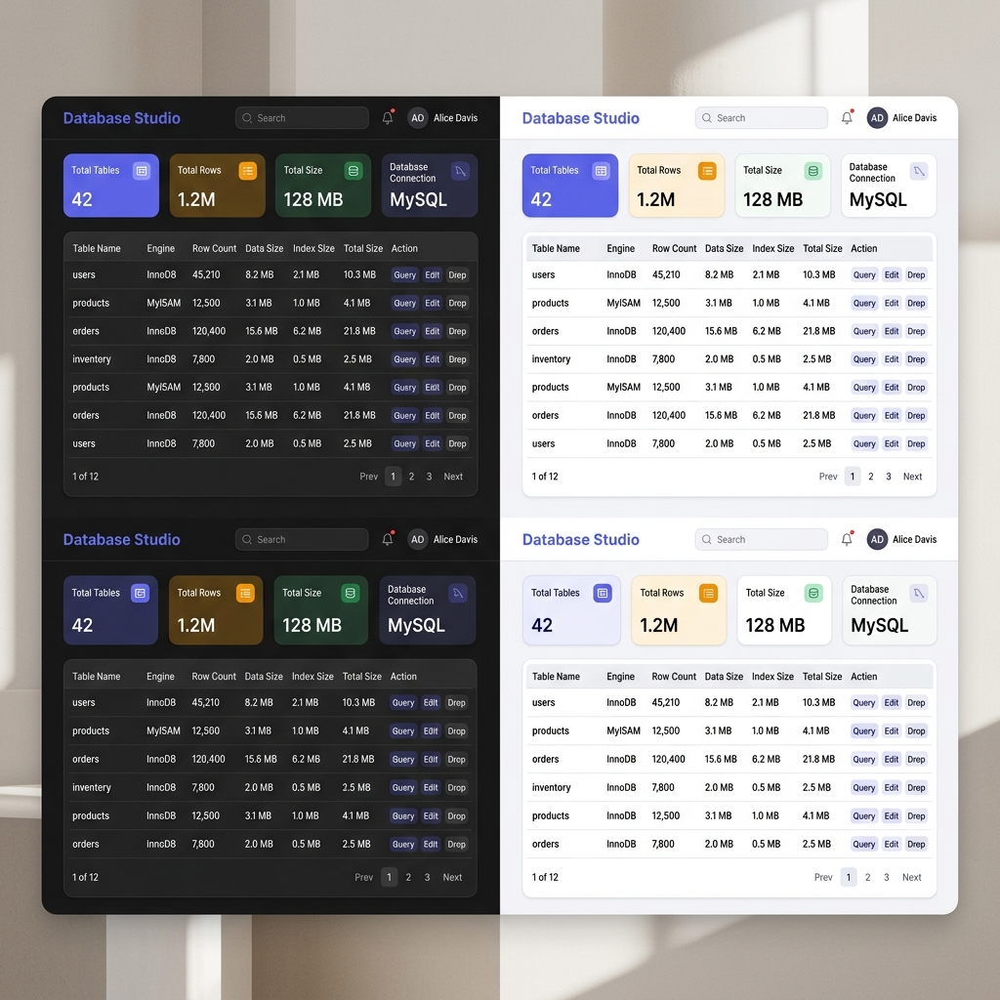
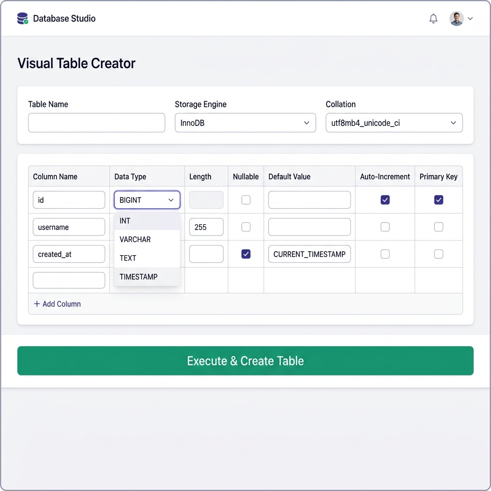
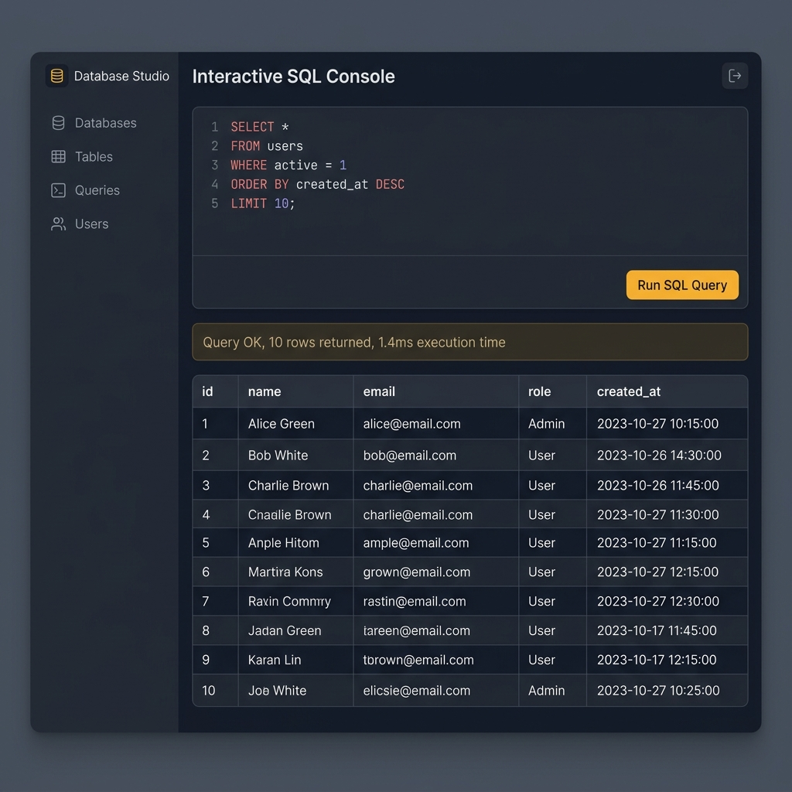
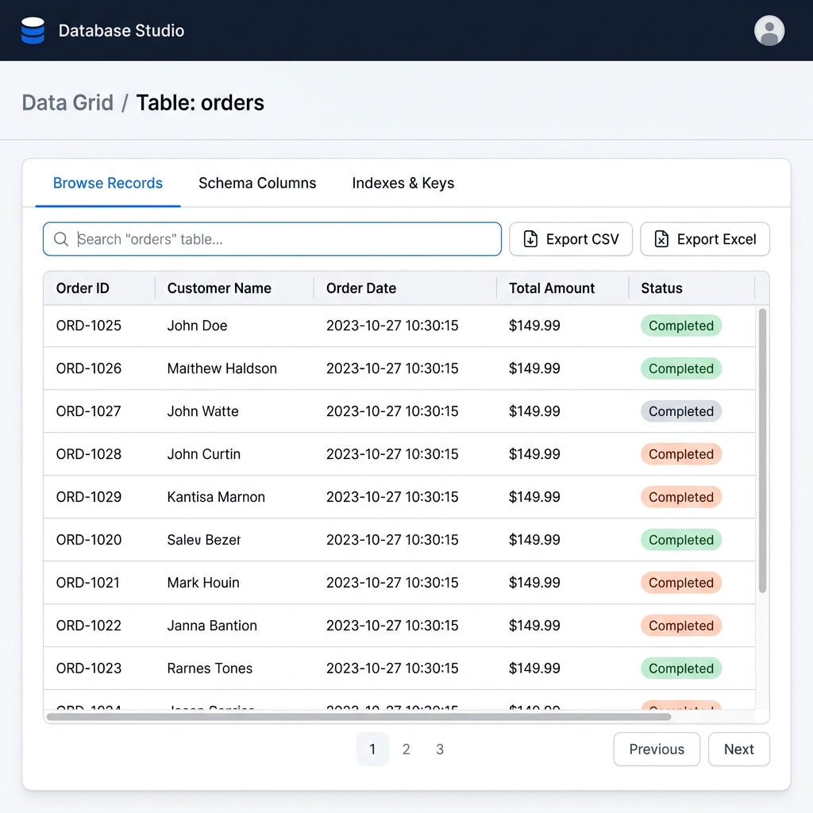

# Laravel Database Studio & Table Manager GUI

[](https://packagist.org/packages/laraforge/database-studio)
[](https://packagist.org/packages/laraforge/database-studio)
[](https://packagist.org/packages/laraforge/database-studio)

A self-contained, Navicat & phpMyAdmin grade **Database Studio & Table Manager GUI** for Laravel 10, 11, 12, and 13 applications.

---

## 📸 Screenshots

| Dashboard Explorer | Visual Table Creator |
| :---: | :---: |
|  |  |

| SQL Query Console | Table Inspector & Data Grid |
| :---: | :---: |
|  |  |

---

## 🌟 Key Features

- ⚡ **Zero DB Setup Needed**: Automatically detects and uses your host Laravel application's active database connection credentials from your `.env` file out-of-the-box.
- 📊 **Interactive Database Dashboard**: View table engine types, estimated row counts, data/index disk sizes, and table collations.
- 🛠️ **Visual Table Creator Wizard**: Design new database tables, define column data types, precision, nullability, auto-increments, and default values.
- 🔍 **Schema Inspector & Data Grid**: Inspect columns, indexes, foreign keys, filter records in real-time with AND logic rules, and browse live rows.
- 💻 **Interactive SQL Console**: Execute raw `SELECT`, `INSERT`, `UPDATE`, `ALTER`, or `CREATE` queries directly from your browser.
- 📥 **One-Click CSV / Excel Exporter**: Export filtered table records directly to UTF-8 CSV or XML Excel formats.
- 🔒 **Safety Guards**: Protect critical system tables (`migrations`, `failed_jobs`, `users`) from accidental truncation or dropping.

---

## ⚡ Automatic Database Credentials (`.env` Integration)

No manual database setup or credentials entry is required!

Database Studio automatically reads your active database connection (`DB_HOST`, `DB_PORT`, `DB_DATABASE`, `DB_USERNAME`, `DB_PASSWORD`) from your application's `.env` file:

```env
DB_CONNECTION=mysql
DB_HOST=127.0.0.1
DB_PORT=3306
DB_DATABASE=your_database_name
DB_USERNAME=root
DB_PASSWORD=secret
```

---

## 🚀 Installation Guide

### Option 1: Installing Locally for Development (e.g. in `C:\laragon\www\jobQueue`)

Since the package is located on your local disk at `C:/laragon/www/laravel-database-studio`, configure Composer in your target project (`jobQueue`) to use a local `path` repository:

1. Open your target application's `composer.json` (e.g. `C:\laragon\www\jobQueue\composer.json`).
2. Add the `"repositories"` block:

```json
"repositories": [
    {
        "type": "path",
        "url": "../laravel-database-studio",
        "options": {
            "symlink": true
        }
    }
]
```

3. Run the require command in your terminal:

```bash
composer require laraforge/database-studio:@dev
```

---

### Option 2: Installing Globally via Packagist (Public Package)

Once you upload this repository to GitHub and submit it to [Packagist.org](https://packagist.org), anyone anywhere in the world can install it directly by running:

```bash
composer require laraforge/database-studio
```

#### Steps to Publish on Packagist:
1. Create a GitHub repository (e.g. `https://github.com/your-username/laravel-database-studio`).
2. Push your package code:
   ```bash
   git init
   git add .
   git commit -m "feat: initial release of database studio package"
   git remote add origin https://github.com/your-username/laravel-database-studio.git
   git tag 1.0.0
   git push -u origin main --tags
   ```
3. Log in to [Packagist.org](https://packagist.org), click **Submit**, and paste your GitHub repository URL.

---

### Step 2: Publish Configuration (Optional)

Publish the `database-studio.php` config file to customize route path, middleware, and protected tables:

```bash
php artisan vendor:publish --tag=database-studio-config
```

---

### Step 3: Access the Web Dashboard

Open your browser and navigate to:

```text
http://localhost/jobQueue/public/database-studio
```
or
```text
http://jobqueue.test/database-studio
```

---

## ⚙️ Configuration (`config/database-studio.php`)

```php
return [
    'enabled' => env('DB_STUDIO_ENABLED', true),
    'path' => env('DB_STUDIO_PATH', 'database-studio'),
    'api_prefix' => env('DB_STUDIO_API_PREFIX', 'api/v1/database-manager'),
    'middleware' => [
        'web' => ['web'],
        'api' => ['api'],
    ],
    // Automatically fetched from env('DB_CONNECTION') if null
    'connection' => env('DB_STUDIO_CONNECTION', null),
    'protected_tables' => [
        'migrations',
        'failed_jobs',
        'personal_access_tokens',
    ],
];
```

---

## 📄 License

The MIT License (MIT). Please see [License File](LICENSE) for more information.
